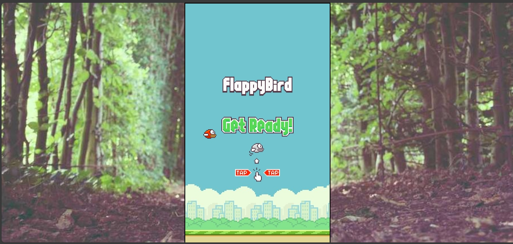

<h1>👋🏽Hi there, I present my first web game project, FlappyBird!</h1>
# 🕹️Game-Project-FlappyBird💻🚀😎

  <h2>Mentor da Aula incrível, foi com o Professor Daniel do <a href="https://aulas.devclub.com.br/">DevClub</a> nos ensinando o passo a passo desse Jogo clássico do Mundo da Programação. Onde foi possível consolidar todas as ferrementas já utilizadas em aulas dentro da plataforma, excelente experência em obter mais conhecimento em Desenvolvimento Web. E amantes de 🕹️Jogos vou me aprofundar nesse vasto ramos da tecnologia e aprender muito mais.</h2>

  <h3>Aqui é: <a href="https://aulas.devclub.com.br/">DevClub</a> 🚀💻A melhor formação de Programadores do País</h3>
  
  
Inicio do Jogo FlappyBird, com um tema de fundo de tela no modo randown via Web:

  
  
Score e Fim do Jogo colidir nos Pipes

  

